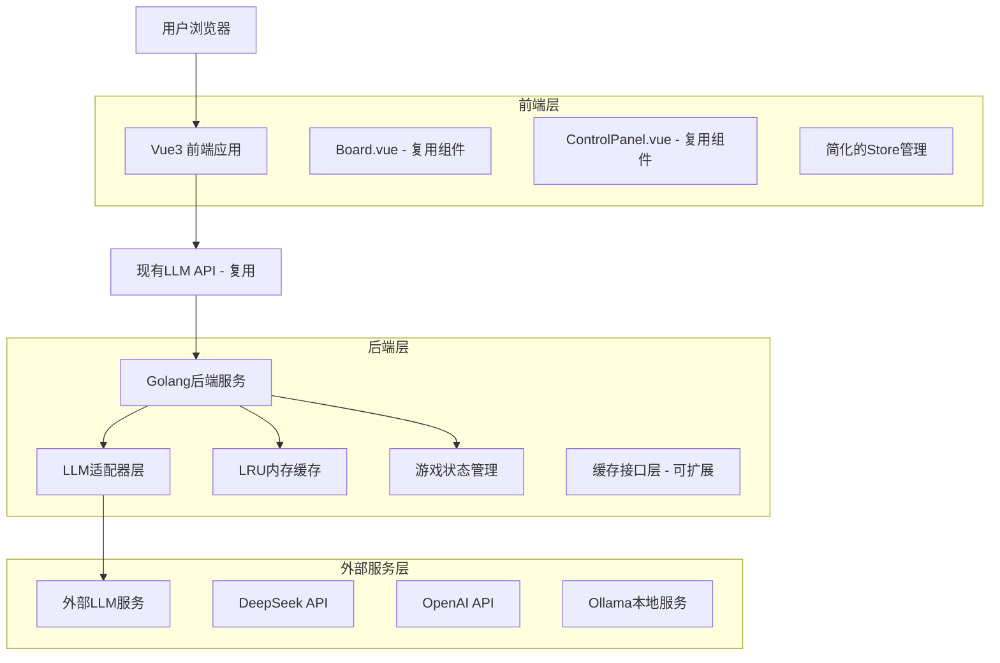
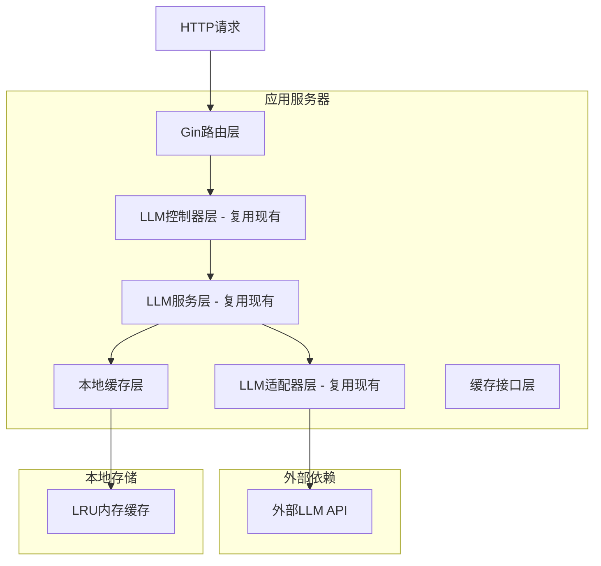
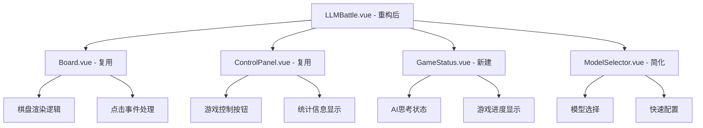

# 与AI对战模块重构技术架构文档

## 1. 架构设计



## 2. 技术描述

* **前端**: Vue3\@3.3 + TypeScript\@5.0 + Pinia\@2.1 + Vite\@4.4

* **后端**: Golang\@1.21 + Gin\@1.9 + 本地内存缓存

* **组件复用**: Board.vue, ControlPanel.vue (来自人机对战模块)

* **状态管理**: 简化的Pinia store，减少复杂状态

* **缓存**: 本地LRU缓存 (LLM响应缓存，预留Redis扩展接口)

## 3. 路由定义

| 路由                 | 用途                |
| ------------------ | ----------------- |
| /llm-battle        | AI对战主页面，统一的游戏界面   |
| /llm-battle/config | 模型配置页面，设置API密钥和参数 |
| /                  | 首页，包含游戏模式选择       |

## 4. API定义

### 4.1 现有LLM接口复用

**复用现有接口，无需新增API**

现有可复用的LLM接口：

```
POST /api/llm/start    # 开始游戏
POST /api/llm/move     # 进行移动(包含人类移动和AI响应)
GET /api/llm/models    # 获取模型列表
PUT /api/llm/config/:model  # 配置模型
GET /api/llm/game/:id  # 获取游戏状态
DELETE /api/llm/game/:id  # 删除游戏
```

**核心接口 - POST /api/llm/move**

Request:

| 参数名    | 参数类型   | 是否必需 | 描述    |
| ------ | ------ | ---- | ----- |
| gameId | string | true | 游戏ID  |
| x      | number | true | 落子X坐标 |
| y      | number | true | 落子Y坐标 |

Response:

| 参数名       | 参数类型    | 描述                            |
| --------- | ------- | ----------------------------- |
| success   | boolean | 请求是否成功                        |
| gameState | object  | 游戏状态                          |
| aiMove    | object  | AI落子位置 {x: number, y: number} |
| gameOver  | boolean | 游戏是否结束                        |
| winner    | number  | 获胜者                           |

### 4.2 本地缓存接口 (内部使用)

**缓存接口层设计 (预留Redis扩展)**

```go
type CacheInterface interface {
    Get(key string) (interface{}, bool)
    Set(key string, value interface{}, ttl time.Duration)
    Delete(key string)
    Clear()
    Stats() CacheStats
}
```

## 5. 服务器架构图



## 6. 数据模型

### 6.1 本地内存数据结构

**游戏状态管理 (内存中)**

```go
type GameSession struct {
    ID           string    `json:"id"`
    Status       string    `json:"status"`
    CurrentPlayer int      `json:"current_player"`
    Board        [][]int   `json:"board"`
    ModelName    string    `json:"model_name"`
    CreatedAt    time.Time `json:"created_at"`
    UpdatedAt    time.Time `json:"updated_at"`
    MoveHistory  []Move    `json:"move_history"`
}

type Move struct {
    X         int       `json:"x"`
    Y         int       `json:"y"`
    Player    int       `json:"player"`
    Timestamp time.Time `json:"timestamp"`
    Reasoning string    `json:"reasoning,omitempty"`
}
```

**缓存数据结构**

```go
type CacheEntry struct {
    Key       string      `json:"key"`
    Value     interface{} `json:"value"`
    ExpiresAt time.Time   `json:"expires_at"`
    CreatedAt time.Time   `json:"created_at"`
}

type LRUCache struct {
    capacity int
    items    map[string]*CacheEntry
    order    *list.List
    mutex    sync.RWMutex
}
```

### 6.2 缓存接口设计 (预留Redis扩展)

**缓存接口定义**

```go
// CacheInterface 定义缓存操作接口，支持后续扩展到Redis
type CacheInterface interface {
    Get(key string) (interface{}, bool)
    Set(key string, value interface{}, ttl time.Duration) error
    Delete(key string) error
    Clear() error
    Stats() CacheStats
    Close() error
}

// CacheStats 缓存统计信息
type CacheStats struct {
    HitCount    int64 `json:"hit_count"`
    MissCount   int64 `json:"miss_count"`
    ItemCount   int   `json:"item_count"`
    HitRate     float64 `json:"hit_rate"`
}
```

**本地内存缓存实现**

```go
// MemoryCache 本地内存缓存实现
type MemoryCache struct {
    cache    *LRUCache
    stats    CacheStats
    mutex    sync.RWMutex
}

func NewMemoryCache(capacity int) CacheInterface {
    return &MemoryCache{
        cache: NewLRUCache(capacity),
        stats: CacheStats{},
    }
}

// 实现CacheInterface接口
func (m *MemoryCache) Get(key string) (interface{}, bool) {
    // 实现逻辑...
}

func (m *MemoryCache) Set(key string, value interface{}, ttl time.Duration) error {
    // 实现逻辑...
}
```

**Redis扩展接口预留**

```go
// RedisCache Redis缓存实现 (预留)
type RedisCache struct {
    client redis.Client
    stats  CacheStats
}

func NewRedisCache(addr, password string, db int) CacheInterface {
    // 预留Redis实现
    return &RedisCache{}
}
```

## 7. 前端组件架构

### 7.1 组件复用策略



### 7.2 状态管理简化

```typescript
// 简化的LLM游戏状态
interface SimpleLLMGameState {
  // 基础游戏状态
  board: number[][]
  currentPlayer: 1 | 2
  gameStatus: 'playing' | 'human_win' | 'ai_win' | 'draw'
  
  // AI相关状态
  selectedModel: string
  isAIThinking: boolean
  lastAIMove: {x: number, y: number} | null
  
  // 游戏统计
  moveCount: number
  gameStartTime: Date | null
  
  // UI状态
  isLoading: boolean
  error: string | null
}
```

### 7.3 性能优化策略

#### 前端优化

* **组件懒加载**：非核心组件使用动态导入

* **状态缓存**：缓存棋盘状态，避免重复计算

* **防抖处理**：用户快速点击时防抖处理

* **虚拟滚动**：移动历史使用虚拟滚动

#### 后端优化

* **本地缓存**：使用LRU内存缓存相同棋盘状态的LLM响应

* **连接池**：使用HTTP连接池减少连接开销

* **异步处理**：LLM调用使用异步处理

* **超时控制**：设置合理的超时时间

* **并发安全**：缓存读写使用互斥锁保证线程安全

#### 缓存策略

* **智能缓存**：基于棋盘状态哈希的缓存键

* **LRU淘汰**：最近最少使用算法，自动管理内存

* **TTL管理**：根据游戏阶段调整缓存时间

* **缓存统计**：命中率、条目数量等性能指标监控

* **扩展预留**：缓存接口设计支持后续Redis扩展

```go
// 缓存键生成策略
func generateCacheKey(board [][]int, model string) string {
    boardHash := sha256.Sum256([]byte(fmt.Sprintf("%v", board)))
    return fmt.Sprintf("llm_move:%s:%x", model, boardHash)
}

// 缓存TTL策略
const (
    CacheTTLShort  = 5 * time.Minute   // 游戏进行中
    CacheTTLMedium = 30 * time.Minute  // 常见棋局
    CacheTTLLong   = 2 * time.Hour     // 开局定式
)
```

## 8. 部署架构

### 8.1 开发环境

```
Frontend (Vue3) -> Backend (Golang) -> 本地内存缓存 -> LLM APIs
     :3000            :8080              内存
```

### 8.2 生产环境 (简化部署)

```
Load Balancer -> Frontend (Nginx) -> Backend (Multiple instances) -> 本地内存缓存 -> LLM APIs
                      :80                 :8080                        内存
```

### 8.3 扩展架构 (预留Redis)

```
Load Balancer -> Frontend (Nginx) -> Backend (Multiple instances) -> Redis Cluster -> LLM APIs
                      :80                 :8080                      :6379
```

### 8.4 监控和日志

* **应用监控**：简化的健康检查端点

* **日志记录**：结构化日志输出

* **缓存监控**：内存使用和命中率统计

* **性能监控**：LLM响应时间和缓存性能指标

