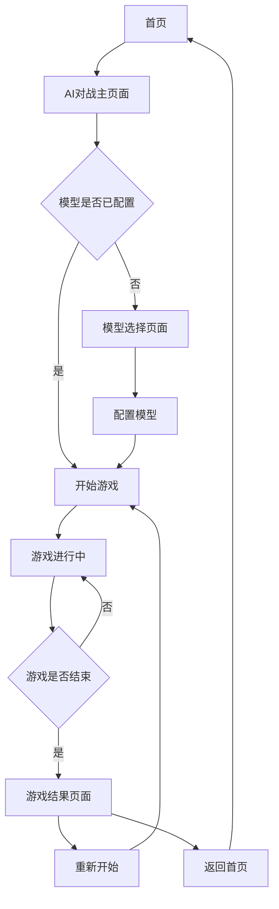

# 与AI对战模块重构需求文档

## 1. 项目概述

本项目旨在重构五子棋游戏中的"与AI对战"模块，使其交互方式与"人机对战"模块保持一致，提供更简洁直观的用户体验。通过统一两个模块的UI界面和交互流程，用户可以享受到一致的游戏体验，同时保留LLM模型的智能决策能力。

- 核心目标：统一"与AI对战"和"人机对战"的用户界面和交互逻辑
- 技术目标：优化LLM接口调用，提升响应速度和稳定性
- 用户价值：提供更直观、流畅的AI对战体验

## 2. 核心功能

### 2.1 用户角色
本模块不需要区分用户角色，所有用户都可以直接使用AI对战功能。

### 2.2 功能模块

重构后的"与AI对战"模块包含以下核心页面：

1. **AI对战主页面**：统一的游戏界面，包含棋盘、控制面板和状态显示
2. **模型选择页面**：简化的模型选择和配置界面
3. **游戏结果页面**：显示对战结果和统计信息

### 2.3 页面详情

| 页面名称 | 模块名称 | 功能描述 |
|---------|----------|----------|
| AI对战主页面 | 游戏棋盘 | 15x15五子棋棋盘，支持点击落子，显示最后一步移动 |
| AI对战主页面 | 控制面板 | 重新开始、悔棋、提示等游戏控制功能 |
| AI对战主页面 | 状态显示 | 显示当前回合、游戏状态、AI思考状态 |
| AI对战主页面 | 模型信息 | 显示当前使用的AI模型信息和状态 |
| 模型选择页面 | 模型列表 | 显示可用的LLM模型及其配置状态 |
| 模型选择页面 | 配置表单 | 配置API密钥和模型参数 |
| 游戏结果页面 | 结果展示 | 显示胜负结果、游戏统计、移动历史 |

## 3. 核心流程

### 3.1 主要用户操作流程

1. **开始游戏流程**：
   - 用户进入AI对战页面
   - 选择可用的AI模型（如未配置则引导配置）
   - 点击开始游戏，初始化棋盘
   - 用户先手，在棋盘上点击落子

2. **游戏进行流程**：
   - 用户点击棋盘位置落子
   - 系统验证落子位置合法性
   - 显示AI思考状态（loading动画）
   - 调用LLM接口获取AI落子位置
   - AI自动落子，更新棋盘状态
   - 检查游戏结束条件（五子连珠或平局）
   - 继续下一轮或结束游戏

3. **游戏结束流程**：
   - 显示游戏结果（胜负或平局）
   - 展示游戏统计信息
   - 提供重新开始或返回选项

### 3.2 页面导航流程图

## 4. 用户界面设计

### 4.1 设计风格

- **主色调**：蓝色系（#3B82F6）和灰色系（#6B7280）
- **辅助色**：绿色（#10B981）表示成功，红色（#EF4444）表示错误，黄色（#F59E0B）表示警告
- **按钮样式**：圆角矩形，悬停时有阴影效果
- **字体**：系统默认字体，标题使用16-24px，正文使用14px
- **布局风格**：卡片式布局，左侧控制面板，中间棋盘，右侧状态信息
- **图标风格**：使用Lucide图标库，简洁现代

### 4.2 页面设计概览

| 页面名称 | 模块名称 | UI元素 |
|---------|----------|--------|
| AI对战主页面 | 游戏棋盘 | 15x15网格，黑白棋子，最后一步高亮显示，悬停效果 |
| AI对战主页面 | 控制面板 | 卡片式布局，按钮使用主色调，图标+文字组合 |
| AI对战主页面 | 状态显示 | 进度条显示游戏进度，彩色状态指示器 |
| AI对战主页面 | AI思考状态 | 旋转动画，渐变背景，思考时间显示 |
| 模型选择页面 | 模型卡片 | 卡片式布局，状态徽章，配置按钮 |
| 游戏结果页面 | 结果弹窗 | 模态对话框，大图标，统计数据表格 |

### 4.3 响应式设计

- **桌面优先**：主要针对桌面端设计，棋盘大小适中
- **移动端适配**：在小屏幕上调整布局，棋盘缩放，控制面板折叠
- **触摸优化**：增大点击区域，优化触摸反馈

## 5. 技术要求

### 5.1 前端重构要求

- **UI统一**：复用"人机对战"的Board.vue和ControlPanel.vue组件
- **状态管理**：简化Pinia store，减少复杂的状态管理
- **交互优化**：用户落子后立即触发AI响应，无需额外操作
- **加载状态**：显示AI思考动画，提供良好的用户反馈
- **错误处理**：优雅处理网络错误和API异常

### 5.2 后端接口要求

- **简化接口**：提供单一的AI决策接口，输入棋盘状态，输出落子坐标
- **响应时间**：确保接口响应时间在3秒以内
- **错误处理**：提供详细的错误信息和重试机制
- **缓存机制**：对相同棋盘状态进行缓存，提升响应速度

### 5.3 性能优化

- **请求缓存**：缓存LLM响应结果，避免重复计算
- **错误重试**：实现指数退避重试策略
- **数据压缩**：优化网络传输数据量
- **异步处理**：使用异步接口，避免阻塞用户界面

## 6. 验收标准

### 6.1 功能验收

- ✅ 用户可以正常开始AI对战游戏
- ✅ 用户落子后AI能在3秒内响应
- ✅ 游戏规则校验正确，无非法落子
- ✅ 胜负判定准确，游戏结束逻辑正确
- ✅ 模型配置功能正常，支持多种LLM模型

### 6.2 性能验收

- ✅ 页面加载时间小于2秒
- ✅ AI响应时间小于3秒
- ✅ 网络错误时能正确重试
- ✅ 界面响应流畅，无明显卡顿

### 6.3 用户体验验收

- ✅ 界面与"人机对战"保持一致
- ✅ 操作流程简单直观
- ✅ 错误提示清晰明确
- ✅ 移动端适配良好

## 7. 项目里程碑

### 7.1 第一阶段：前端重构（预计3天）
- 重构LLMBattle.vue组件
- 复用Board.vue和ControlPanel.vue
- 简化状态管理逻辑

### 7.2 第二阶段：后端优化（预计2天）
- 优化LLM接口响应时间
- 实现请求缓存机制
- 完善错误处理逻辑

### 7.3 第三阶段：联调测试（预计2天）
- 前后端集成测试
- 性能测试和优化
- 用户体验测试

### 7.4 第四阶段：文档和部署（预计1天）
- 编写技术文档
- 部署测试环境
- 用户验收测试