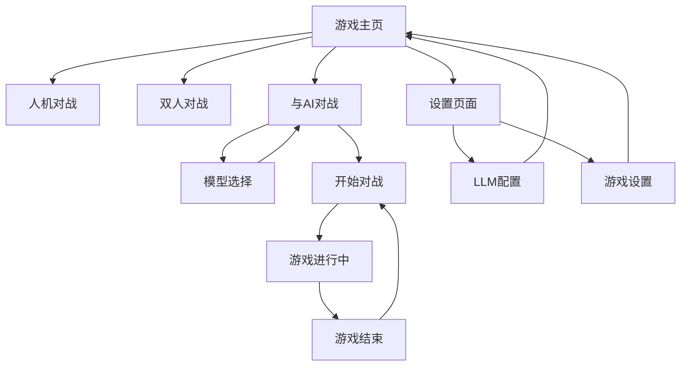

# 五子棋LLM对战功能需求文档

## 1. 产品概述

本项目旨在为现有五子棋游戏新增"与AI对战"功能模块，实现人类玩家与大语言模型(LLM)的智能对战体验。该功能将为用户提供更具挑战性和趣味性的游戏体验，通过集成先进的LLM技术，打造具有自然语言理解和策略思考能力的AI对手。

产品将采用可扩展的架构设计，支持多种LLM模型的快速切换和配置，为后续功能扩展和模型升级提供良好的技术基础。

## 2. 核心功能

### 2.1 用户角色

| 角色 | 注册方式 | 核心权限 |
|------|----------|----------|
| 普通用户 | 无需注册，直接使用 | 可进行人机对战、双人对战、LLM对战等所有游戏功能 |

### 2.2 功能模块

本次新增功能在现有五子棋游戏基础上扩展，主要页面包括：

1. **游戏主页**：游戏模式选择、导航菜单、功能入口
2. **LLM对战页面**：LLM对战游戏界面、模型选择、对战控制
3. **设置页面**：LLM模型配置、游戏参数设置

### 2.3 页面详情

| 页面名称 | 模块名称 | 功能描述 |
|----------|----------|----------|
| 游戏主页 | 模式选择区 | 新增"与AI对战"选项，与现有"人机对战"、"双人对战"并列显示 |
| 游戏主页 | 导航菜单 | 提供设置入口，支持LLM模型配置访问 |
| LLM对战页面 | 游戏棋盘 | 15x15标准五子棋棋盘，支持点击下棋、棋子显示、胜负判定 |
| LLM对战页面 | 模型选择器 | 下拉选择框，支持DeepSeek、ChatGPT、Ollama等模型切换 |
| LLM对战页面 | 对战控制面板 | 开始游戏、重新开始、认输、悔棋等操作按钮 |
| LLM对战页面 | 状态显示区 | 显示当前回合、游戏状态、LLM思考过程、胜负结果 |
| LLM对战页面 | 对话区域 | 显示LLM的思考过程和策略分析（可选功能） |
| 设置页面 | LLM配置 | API密钥配置、模型参数设置、超时时间配置 |
| 设置页面 | 游戏设置 | 难度级别、思考时间限制、界面主题等配置 |

## 3. 核心流程

### 3.1 LLM对战流程

用户进入游戏主页 → 选择"与AI对战"模式 → 选择LLM模型 → 配置对战参数 → 开始游戏 → 用户下棋 → LLM分析棋局并下棋 → 循环对战直至游戏结束 → 显示结果并提供重新开始选项

### 3.2 模型切换流程

用户在对战页面 → 点击模型选择器 → 选择目标LLM模型 → 系统验证模型可用性 → 切换成功并更新界面状态

### 3.3 页面导航流程图

## 4. 用户界面设计

### 4.1 设计风格

- **主色调**：保持现有设计风格，主色为深蓝色(#2563eb)，辅助色为绿色(#16a34a)
- **按钮样式**：圆角矩形按钮，支持悬停效果和点击反馈
- **字体**：中文使用微软雅黑，英文使用Roboto，主要字号14px-16px
- **布局风格**：卡片式布局，顶部导航，响应式设计
- **图标风格**：使用简洁的线性图标，支持AI、设置、对战等主题图标

### 4.2 页面设计概览

| 页面名称 | 模块名称 | UI元素 |
|----------|----------|---------|
| 游戏主页 | 模式选择区 | 三个并列的卡片式按钮，新增"与AI对战"卡片，使用AI图标，渐变背景色 |
| LLM对战页面 | 游戏棋盘 | 居中显示，15x15网格，黑白棋子，最后落子高亮显示 |
| LLM对战页面 | 模型选择器 | 顶部位置，下拉选择框，显示模型名称和状态指示器 |
| LLM对战页面 | 控制面板 | 右侧边栏，垂直排列按钮，包含图标和文字说明 |
| LLM对战页面 | 状态显示 | 底部状态栏，显示当前玩家、思考状态、加载动画 |
| 设置页面 | 配置表单 | 分组表单布局，标签页切换，输入框和选择器组合 |

### 4.3 响应式设计

产品采用桌面优先的响应式设计，在移动设备上自动适配为触摸友好的界面布局，确保在不同屏幕尺寸下都能提供良好的用户体验。