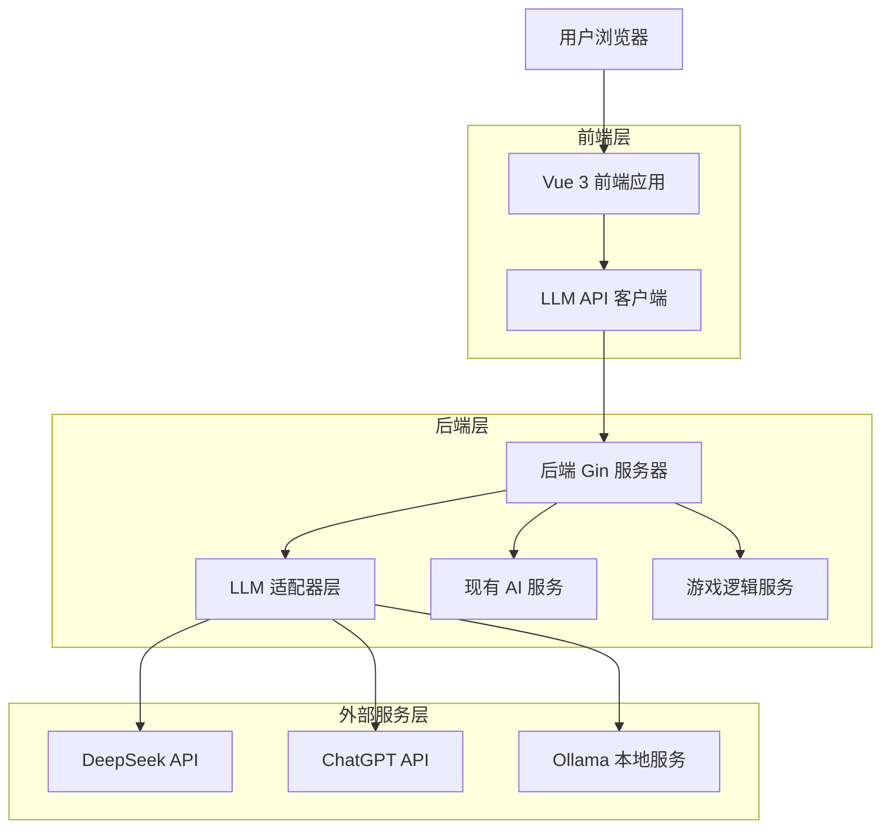
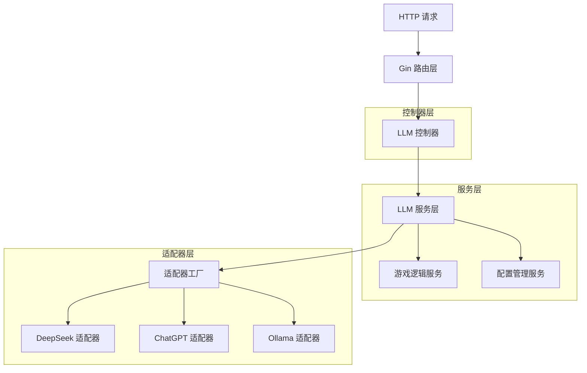
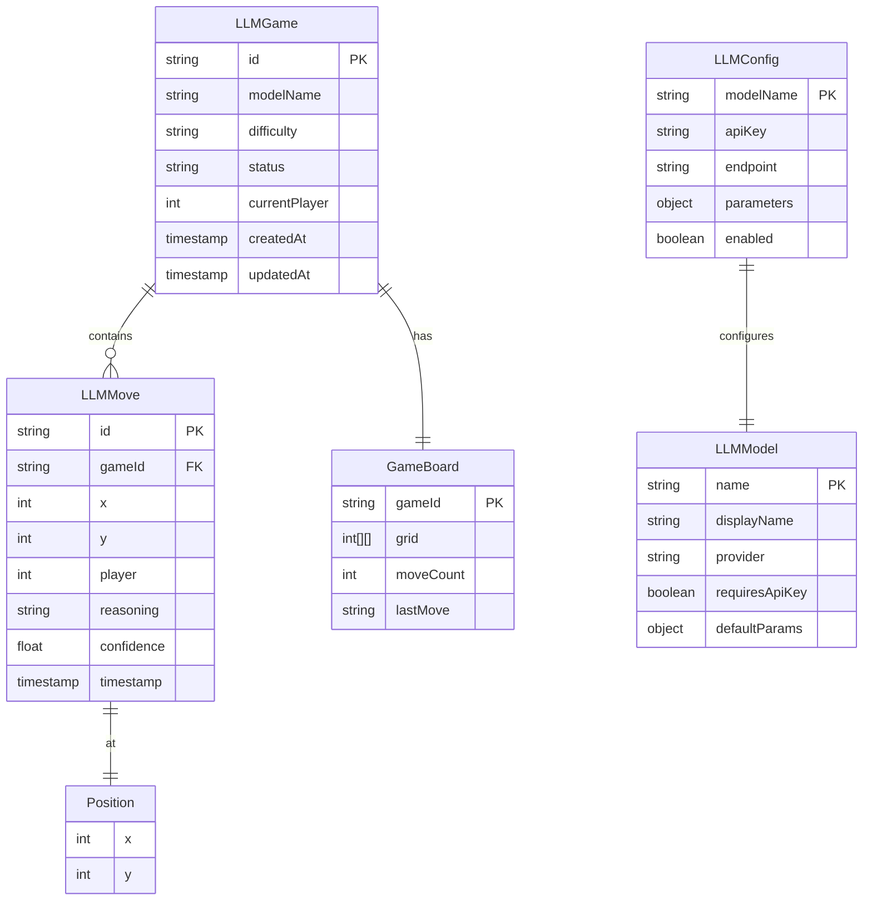

# 五子棋LLM对战技术架构文档

## 1. 架构设计



## 2. 技术描述

- 前端：Vue 3 + TypeScript + Vite + Pinia + TailwindCSS
- 后端：Golang + Gin + 现有 AI 服务
- LLM 集成：DeepSeek API + ChatGPT API + Ollama 本地服务
- 数据存储：内存存储（游戏状态）+ 本地存储（用户配置）

## 3. 路由定义

| 路由 | 用途 |
|------|------|
| /home | 游戏主页，显示所有游戏模式选择 |
| /ai-battle | LLM对战页面，提供与大语言模型的对战功能 |
| /human-vs-ai | 现有人机对战页面（保持不变） |
| /pvp | 现有双人对战页面（保持不变） |
| /settings | 设置页面，包含LLM配置和游戏参数设置 |

## 4. API定义

### 4.1 核心API

LLM对战相关接口

```
POST /api/llm/move
```

请求参数：
| 参数名称 | 参数类型 | 是否必需 | 描述 |
|----------|----------|----------|------|
| board | number[][] | true | 当前棋盘状态，15x15二维数组 |
| lastMove | Move | true | 上一步棋的位置信息 |
| model | string | true | 使用的LLM模型名称 |
| difficulty | string | false | 难度级别：easy/medium/hard |

响应参数：
| 参数名称 | 参数类型 | 描述 |
|----------|----------|------|
| success | boolean | 请求是否成功 |
| move | LLMMove | LLM选择的下棋位置 |
| reasoning | string | LLM的思考过程（可选） |
| gameStatus | string | 游戏状态 |
| error | string | 错误信息（如果有） |

请求示例：
```json
{
  "board": [[0,0,0,...], [0,1,0,...], ...],
  "lastMove": {"x": 7, "y": 7, "player": 1},
  "model": "deepseek",
  "difficulty": "medium"
}
```

响应示例：
```json
{
  "success": true,
  "move": {
    "x": 8,
    "y": 7,
    "confidence": 0.85
  },
  "reasoning": "我选择在(8,7)位置下棋，因为这样可以阻止对手形成三连...",
  "gameStatus": "playing"
}
```

```
GET /api/llm/models
```

获取可用的LLM模型列表

响应参数：
| 参数名称 | 参数类型 | 描述 |
|----------|----------|------|
| models | LLMModel[] | 可用模型列表 |

```
POST /api/llm/config
```

配置LLM模型参数

请求参数：
| 参数名称 | 参数类型 | 是否必需 | 描述 |
|----------|----------|----------|------|
| model | string | true | 模型名称 |
| apiKey | string | false | API密钥（加密存储） |
| endpoint | string | false | 自定义API端点 |
| parameters | object | false | 模型特定参数 |

## 5. 服务器架构图



## 6. 数据模型

### 6.1 数据模型定义



### 6.2 数据定义语言

由于本项目采用内存存储方案，以下为主要数据结构的Go语言定义：

LLM游戏状态表 (LLMGame)
```go
// LLMGame represents a game session with LLM
type LLMGame struct {
    ID            string    `json:"id"`
    ModelName     string    `json:"modelName"`
    Difficulty    string    `json:"difficulty"`
    Status        string    `json:"status"` // "playing", "finished", "error"
    CurrentPlayer int       `json:"currentPlayer"`
    Board         *Board    `json:"board"`
    Moves         []LLMMove `json:"moves"`
    CreatedAt     time.Time `json:"createdAt"`
    UpdatedAt     time.Time `json:"updatedAt"`
}

// LLMMove represents a move made by LLM
type LLMMove struct {
    ID         string    `json:"id"`
    GameID     string    `json:"gameId"`
    X          int       `json:"x"`
    Y          int       `json:"y"`
    Player     int       `json:"player"`
    Reasoning  string    `json:"reasoning,omitempty"`
    Confidence float64   `json:"confidence"`
    Timestamp  time.Time `json:"timestamp"`
}

// LLMConfig represents LLM model configuration
type LLMConfig struct {
    ModelName  string                 `json:"modelName"`
    APIKey     string                 `json:"apiKey,omitempty"`
    Endpoint   string                 `json:"endpoint,omitempty"`
    Parameters map[string]interface{} `json:"parameters,omitempty"`
    Enabled    bool                   `json:"enabled"`
}

// LLMModel represents available LLM model information
type LLMModel struct {
    Name           string                 `json:"name"`
    DisplayName    string                 `json:"displayName"`
    Provider       string                 `json:"provider"`
    RequiresAPIKey bool                   `json:"requiresApiKey"`
    DefaultParams  map[string]interface{} `json:"defaultParams"`
}

// LLMAdapter interface for different LLM providers
type LLMAdapter interface {
    GetMove(board [][]int, lastMove Move, config LLMConfig) (*LLMMove, error)
    ValidateConfig(config LLMConfig) error
    GetModelInfo() LLMModel
}
```

初始化数据
```go
// 预定义可用的LLM模型
var DefaultLLMModels = []LLMModel{
    {
        Name:           "deepseek",
        DisplayName:    "DeepSeek",
        Provider:       "deepseek",
        RequiresAPIKey: true,
        DefaultParams: map[string]interface{}{
            "temperature": 0.7,
            "max_tokens":  1000,
        },
    },
    {
        Name:           "chatgpt",
        DisplayName:    "ChatGPT",
        Provider:       "openai",
        RequiresAPIKey: true,
        DefaultParams: map[string]interface{}{
            "model":       "gpt-3.5-turbo",
            "temperature": 0.7,
            "max_tokens":  1000,
        },
    },
    {
        Name:           "ollama",
        DisplayName:    "Ollama Local",
        Provider:       "ollama",
        RequiresAPIKey: false,
        DefaultParams: map[string]interface{}{
            "model":       "llama2",
            "temperature": 0.7,
        },
    },
}

// 默认LLM配置
var DefaultLLMConfigs = map[string]LLMConfig{
    "deepseek": {
        ModelName:  "deepseek",
        Endpoint:   "https://api.deepseek.com/v1/chat/completions",
        Parameters: map[string]interface{}{"temperature": 0.7},
        Enabled:    true,
    },
    "ollama": {
        ModelName:  "ollama",
        Endpoint:   "http://localhost:11434/api/generate",
        Parameters: map[string]interface{}{"model": "llama2"},
        Enabled:    false,
    },
}
```