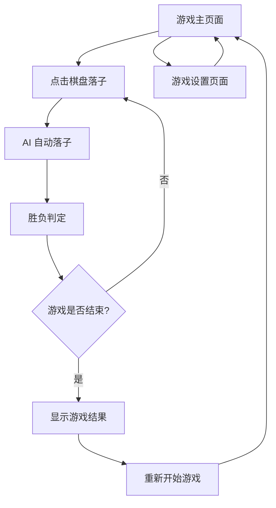

# 五子棋人机对战项目需求文档 (PRD)

## 1. Product Overview

Gomoku Online 是一个基于 Web 的五子棋游戏平台，当前阶段专注于提供流畅的人机对战体验。

- 项目采用前后端分离架构，使用 Golang(Gin) + Vue3(Vite) 技术栈，为用户提供现代化的游戏体验。
- 通过智能 AI 算法实现具有挑战性的人机对战，同时预留完整的在线匹配架构以支持未来的 PVP 功能扩展。
- 目标是打造一个可扩展、高性能的五子棋游戏平台，为后续商业化运营奠定技术基础。

## 2. Core Features

### 2.1 User Roles

| Role | Registration Method | Core Permissions |
|------|---------------------|------------------|
| 游戏玩家 | 无需注册，直接访问 | 可进行人机对战、重新开始游戏、查看游戏状态 |

### 2.2 Feature Module

我们的五子棋游戏需求包含以下主要页面：

1. **游戏主页面**：棋盘显示区域、游戏控制面板、游戏状态显示
2. **游戏设置页面**：游戏模式选择、难度设置（预留）

### 2.3 Page Details

| Page Name | Module Name | Feature description |
|-----------|-------------|---------------------|
| 游戏主页面 | 棋盘组件 | 渲染 15x15 棋盘格子，支持点击落子，显示黑白棋子状态，实时更新棋盘 |
| 游戏主页面 | 控制面板 | 提供重新开始按钮，显示当前游戏模式，显示游戏状态（进行中/结束） |
| 游戏主页面 | AI 对战逻辑 | 用户落子后自动调用 AI 接口，获取 AI 落子位置，更新棋盘状态 |
| 游戏主页面 | 胜负判定 | 实时检测五子连珠，显示游戏结果，支持游戏结束后重新开始 |
| 游戏设置页面 | 模式选择 | 当前支持人机对战模式，预留在线对战模式选择功能 |

## 3. Core Process

**主要用户操作流程：**

用户访问游戏页面 → 查看 15x15 棋盘 → 点击空白格子落子 → 系统调用 AI 接口获取 AI 落子 → 更新棋盘显示 → 检查胜负状态 → 显示游戏结果或继续游戏 → 可选择重新开始

## 4. User Interface Design

### 4.1 Design Style

- **主色调**：深蓝色 (#1e3a8a) 和金黄色 (#f59e0b)，营造专业的棋类游戏氛围
- **次要色彩**：浅灰色 (#f3f4f6) 背景，深灰色 (#374151) 文字
- **按钮样式**：圆角矩形按钮，具有悬停效果和点击反馈
- **字体**：中文使用微软雅黑，英文使用 Arial，主要字号 14px-16px
- **布局风格**：居中卡片式布局，棋盘为主体，控制面板位于右侧
- **图标风格**：使用简洁的线性图标，棋子采用经典的黑白圆形设计

### 4.2 Page Design Overview

| Page Name | Module Name | UI Elements |
|-----------|-------------|-------------|
| 游戏主页面 | 棋盘组件 | 15x15 网格布局，格子大小 30px，黑白棋子直径 24px，悬停高亮效果，落子动画 |
| 游戏主页面 | 控制面板 | 垂直布局卡片，包含游戏状态文字、重新开始按钮（蓝色主色调）、模式显示标签 |
| 游戏主页面 | 页面布局 | Flexbox 水平布局，棋盘居左，控制面板居右，响应式间距设计 |
| 游戏设置页面 | 设置面板 | 简洁的表单布局，下拉选择框，确认按钮，返回按钮 |

### 4.3 Responsiveness

项目采用桌面优先设计，针对 1024px 以上屏幕优化，同时支持平板设备适配。棋盘组件支持触摸操作，在移动设备上提供良好的点击体验。