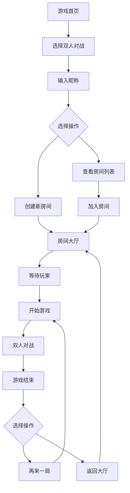

# 五子棋双人对战功能需求文档

## 1. 产品概述

基于现有的五子棋人机对战系统，新增双人在线对战功能，实现玩家之间的实时对战体验。
该功能将通过WebSocket技术提供低延迟的实时通信，支持房间管理、游戏状态同步和完整的对战流程。
目标是为用户提供流畅、稳定的在线对战体验，扩展产品的社交属性和用户粘性。

## 2. 核心功能

### 2.1 用户角色

| 角色 | 注册方式 | 核心权限 |
|------|----------|----------|
| 普通玩家 | 无需注册，输入昵称即可 | 可创建房间、加入房间、进行对战 |
| 房主 | 创建房间的玩家 | 可管理房间设置、踢出玩家、开始游戏 |

### 2.2 功能模块

我们的双人对战需求包含以下主要页面：
1. **游戏模式选择页面**：模式切换、房间列表、创建房间入口
2. **房间大厅页面**：房间信息、玩家列表、游戏设置、开始游戏
3. **双人对战页面**：实时棋盘、游戏状态、聊天功能、投降/求和
4. **游戏结果页面**：胜负结果、统计信息、再来一局

### 2.3 页面详情

| 页面名称 | 模块名称 | 功能描述 |
|----------|----------|----------|
| 游戏模式选择页面 | 模式切换器 | 在人机对战和双人对战之间切换 |
| 游戏模式选择页面 | 房间列表 | 显示当前可加入的房间，包含房间名、玩家数、状态 |
| 游戏模式选择页面 | 创建房间 | 输入房间名和昵称创建新房间 |
| 房间大厅页面 | 房间信息 | 显示房间ID、房间名、创建时间 |
| 房间大厅页面 | 玩家列表 | 显示房间内玩家昵称、状态、准备情况 |
| 房间大厅页面 | 游戏设置 | 设置先手玩家、时间限制等规则 |
| 房间大厅页面 | 房间控制 | 开始游戏、离开房间、踢出玩家 |
| 双人对战页面 | 实时棋盘 | 显示当前棋局、实时同步双方落子 |
| 双人对战页面 | 游戏状态 | 显示当前回合、倒计时、步数统计 |
| 双人对战页面 | 玩家信息 | 显示双方昵称、执子颜色、在线状态 |
| 双人对战页面 | 游戏控制 | 投降、求和、悔棋申请 |
| 双人对战页面 | 聊天功能 | 实时文字聊天、快捷表情 |
| 游戏结果页面 | 结果展示 | 显示胜负结果、获胜方式、用时统计 |
| 游戏结果页面 | 操作选项 | 再来一局、返回大厅、分享结果 |

## 3. 核心流程

### 普通玩家流程
1. 用户进入游戏，选择双人对战模式
2. 输入昵称，查看房间列表或创建新房间
3. 加入房间后等待其他玩家，房主开始游戏
4. 进入对战界面，轮流落子直到游戏结束
5. 查看游戏结果，选择再来一局或返回大厅

### 房主流程
1. 创建房间，设置房间名和游戏规则
2. 等待其他玩家加入，管理房间成员
3. 确认所有玩家准备后开始游戏
4. 正常进行对战流程

## 4. 用户界面设计

### 4.1 设计风格

- **主色调**：#8B4513（棕色）、#DEB887（浅棕色）、#2E8B57（海绿色）
- **辅助色**：#FF6B6B（红色警告）、#4ECDC4（青色提示）、#45B7D1（蓝色信息）
- **按钮样式**：圆角矩形，渐变背景，悬停效果
- **字体**：主要使用系统默认字体，标题16-20px，正文14px
- **布局风格**：卡片式布局，顶部导航，响应式设计
- **图标风格**：简洁线条图标，配合适当的动画效果

### 4.2 页面设计概览

| 页面名称 | 模块名称 | UI元素 |
|----------|----------|---------|
| 游戏模式选择页面 | 模式切换器 | 标签页样式，突出当前选中模式，平滑切换动画 |
| 游戏模式选择页面 | 房间列表 | 卡片式布局，显示房间状态图标，支持刷新和搜索 |
| 游戏模式选择页面 | 创建房间 | 模态对话框，表单验证，主色调按钮 |
| 房间大厅页面 | 房间信息 | 顶部信息栏，房间ID可复制，状态指示器 |
| 房间大厅页面 | 玩家列表 | 头像+昵称布局，在线状态指示，准备状态标识 |
| 房间大厅页面 | 游戏设置 | 开关组件，下拉选择器，设置项分组显示 |
| 双人对战页面 | 实时棋盘 | 保持现有棋盘样式，增加对手落子动画效果 |
| 双人对战页面 | 游戏状态 | 顶部状态栏，倒计时圆形进度条，回合指示器 |
| 双人对战页面 | 聊天功能 | 右侧聊天面板，消息气泡，表情选择器 |
| 游戏结果页面 | 结果展示 | 大号文字显示结果，胜利动画效果，统计图表 |

### 4.3 响应式设计

产品采用桌面优先设计，同时适配移动端。在移动设备上，聊天功能可收缩为浮动按钮，棋盘自适应屏幕大小，支持触摸操作优化。

## 5. 技术要求

### 5.1 实时性要求
- WebSocket连接延迟 < 100ms
- 落子同步延迟 < 200ms
- 聊天消息延迟 < 300ms

### 5.2 稳定性要求
- 支持断线重连机制
- 游戏状态持久化存储
- 异常情况下的优雅降级

### 5.3 用户体验要求
- 界面响应时间 < 500ms
- 支持键盘快捷键操作
- 提供音效和视觉反馈

## 6. 数据统计

### 6.1 游戏数据
- 对战记录：胜负结果、用时、步数
- 玩家统计：胜率、总局数、平均用时
- 房间统计：创建数量、活跃时长

### 6.2 用户行为
- 页面访问统计
- 功能使用频率
- 用户留存分析