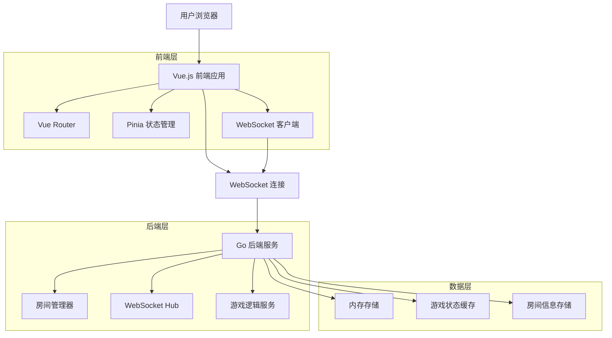
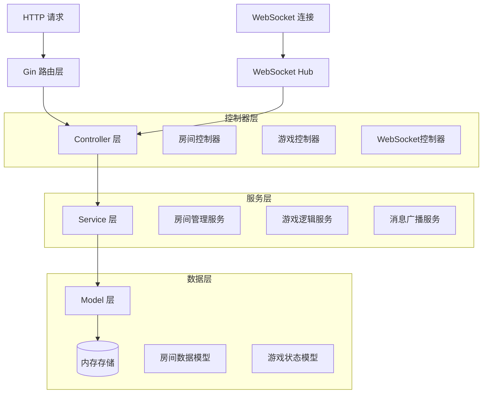
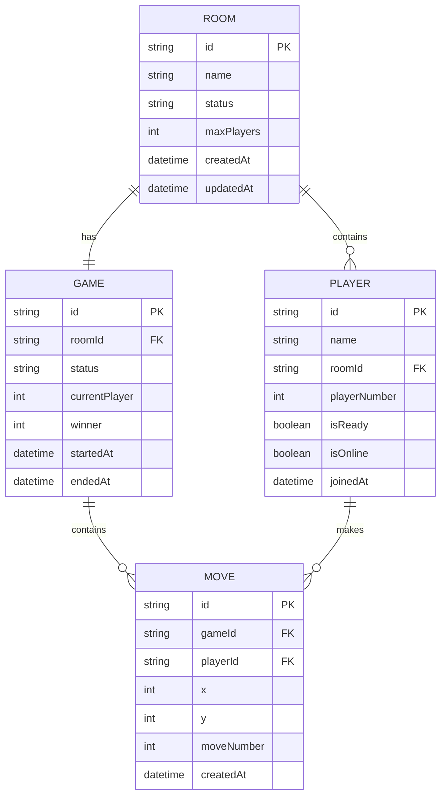

# 五子棋双人对战技术架构文档

## 1. 架构设计



## 2. 技术描述

* **前端**: Vue\@3 + TypeScript + Vite + Pinia

* **后端**: Go\@1.21 + Gin + Gorilla WebSocket

* **数据存储**: 内存存储（Redis可选）

* **通信协议**: WebSocket + JSON

* **部署**: 单体应用部署

## 3. 路由定义

| 路由              | 用途                 |
| --------------- | ------------------ |
| /               | 游戏首页，包含模式选择和人机对战   |
| /pvp            | 双人对战模式主页，显示房间列表    |
| /room/:roomId   | 房间大厅页面，显示房间信息和玩家列表 |
| /game/:roomId   | 双人对战游戏页面，实时对战界面    |
| /result/:roomId | 游戏结果页面，显示对战结果      |

## 4. API定义

### 4.1 核心API

#### 房间管理相关

```
POST /api/rooms
```

创建新房间

请求:

| 参数名        | 参数类型   | 是否必需  | 描述         |
| ---------- | ------ | ----- | ---------- |
| roomName   | string | true  | 房间名称       |
| playerName | string | true  | 创建者昵称      |
| maxPlayers | int    | false | 最大玩家数（默认2） |

响应:

| 参数名    | 参数类型   | 描述     |
| ------ | ------ | ------ |
| roomId | string | 房间唯一标识 |
| status | string | 创建状态   |

示例:

```json
{
  "roomName": "友谊赛",
  "playerName": "玩家1",
  "maxPlayers": 2
}
```

```
GET /api/rooms
```

获取房间列表

响应:

| 参数名   | 参数类型  | 描述   |
| ----- | ----- | ---- |
| rooms | array | 房间列表 |
| total | int   | 房间总数 |

```
POST /api/rooms/:roomId/join
```

加入房间

请求:

| 参数名        | 参数类型   | 是否必需 | 描述   |
| ---------- | ------ | ---- | ---- |
| playerName | string | true | 玩家昵称 |

```
DELETE /api/rooms/:roomId/leave
```

离开房间

请求:

| 参数名      | 参数类型   | 是否必需 | 描述   |
| -------- | ------ | ---- | ---- |
| playerId | string | true | 玩家ID |

#### 游戏控制相关

```
POST /api/rooms/:roomId/start
```

开始游戏

```
POST /api/rooms/:roomId/move
```

执行移动

请求:

| 参数名      | 参数类型   | 是否必需 | 描述   |
| -------- | ------ | ---- | ---- |
| x        | int    | true | X坐标  |
| y        | int    | true | Y坐标  |
| playerId | string | true | 玩家ID |

```
GET /api/rooms/:roomId/status
```

获取房间状态

#### WebSocket连接

```
WS /ws/:roomId
```

WebSocket连接端点

消息类型:

* `join`: 玩家加入

* `leave`: 玩家离开

* `move`: 游戏移动

* `chat`: 聊天消息

* `game_start`: 游戏开始

* `game_end`: 游戏结束

* `room_update`: 房间状态更新

### 4.2 WebSocket消息格式

#### 客户端发送消息

```typescript
interface ClientMessage {
  type: 'join' | 'leave' | 'move' | 'chat' | 'ready'
  data: {
    playerId?: string
    playerName?: string
    x?: number
    y?: number
    message?: string
  }
}
```

#### 服务端推送消息

```typescript
interface ServerMessage {
  type: 'player_joined' | 'player_left' | 'move_made' | 'chat_message' | 'game_started' | 'game_ended' | 'room_updated'
  data: {
    playerId?: string
    playerName?: string
    x?: number
    y?: number
    message?: string
    gameState?: GameState
    roomInfo?: RoomInfo
  }
}
```

## 5. 服务端架构图



## 6. 数据模型

### 6.1 数据模型定义



### 6.2 数据定义语言

#### 房间表 (rooms)

```go
type Room struct {
    ID          string    `json:"id"`
    Name        string    `json:"name"`
    Status      string    `json:"status"` // waiting, playing, finished
    MaxPlayers  int       `json:"maxPlayers"`
    Players     []Player  `json:"players"`
    Game        *Game     `json:"game,omitempty"`
    CreatedAt   time.Time `json:"createdAt"`
    UpdatedAt   time.Time `json:"updatedAt"`
}
```

#### 玩家表 (players)

```go
type Player struct {
    ID           string    `json:"id"`
    Name         string    `json:"name"`
    RoomID       string    `json:"roomId"`
    PlayerNumber int       `json:"playerNumber"` // 1 or 2
    IsReady      bool      `json:"isReady"`
    IsOnline     bool      `json:"isOnline"`
    JoinedAt     time.Time `json:"joinedAt"`
}
```

#### 游戏表 (games)

```go
type Game struct {
    ID            string    `json:"id"`
    RoomID        string    `json:"roomId"`
    Status        string    `json:"status"` // playing, finished
    Board         [][]int   `json:"board"`
    CurrentPlayer int       `json:"currentPlayer"`
    Winner        int       `json:"winner"`
    MoveCount     int       `json:"moveCount"`
    Moves         []Move    `json:"moves"`
    StartedAt     time.Time `json:"startedAt"`
    EndedAt       *time.Time `json:"endedAt,omitempty"`
}
```

#### 移动记录表 (moves)

```go
type Move struct {
    ID         string    `json:"id"`
    GameID     string    `json:"gameId"`
    PlayerID   string    `json:"playerId"`
    X          int       `json:"x"`
    Y          int       `json:"y"`
    MoveNumber int       `json:"moveNumber"`
    CreatedAt  time.Time `json:"createdAt"`
}
```

#### WebSocket消息结构

```go
type WSMessage struct {
    Type string      `json:"type"`
    Data interface{} `json:"data"`
}

type RoomUpdateData struct {
    Room   *Room   `json:"room"`
    Player *Player `json:"player,omitempty"`
}

type GameUpdateData struct {
    Game     *Game `json:"game"`
    LastMove *Move `json:"lastMove,omitempty"`
}

type ChatMessageData struct {
    PlayerID   string    `json:"playerId"`
    PlayerName string    `json:"playerName"`
    Message    string    `json:"message"`
    Timestamp  time.Time `json:"timestamp"`
}
```

## 7. 关键技术实现

### 7.1 WebSocket连接管理

* 使用连接池管理所有WebSocket连接

* 实现心跳检测机制防止连接断开

* 支持断线重连和状态恢复

### 7.2 房间状态同步

* 使用发布-订阅模式广播房间状态变化

* 实现乐观锁机制处理并发操作

* 定期清理无效房间和连接

### 7.3 游戏逻辑处理

* 复用现有的游戏逻辑代码

* 增加双人对战的状态验证

* 实现游戏回放和历史记录

### 7.4 前端状态管理

* 使用Pinia管理全局游戏状态

* 实现WebSocket自动重连机制

* 优化UI响应性和用户体验

