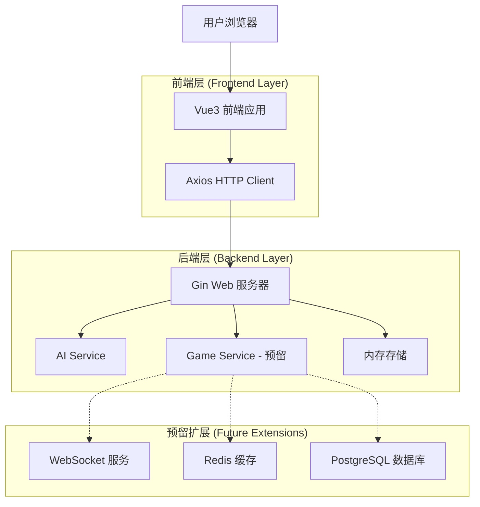
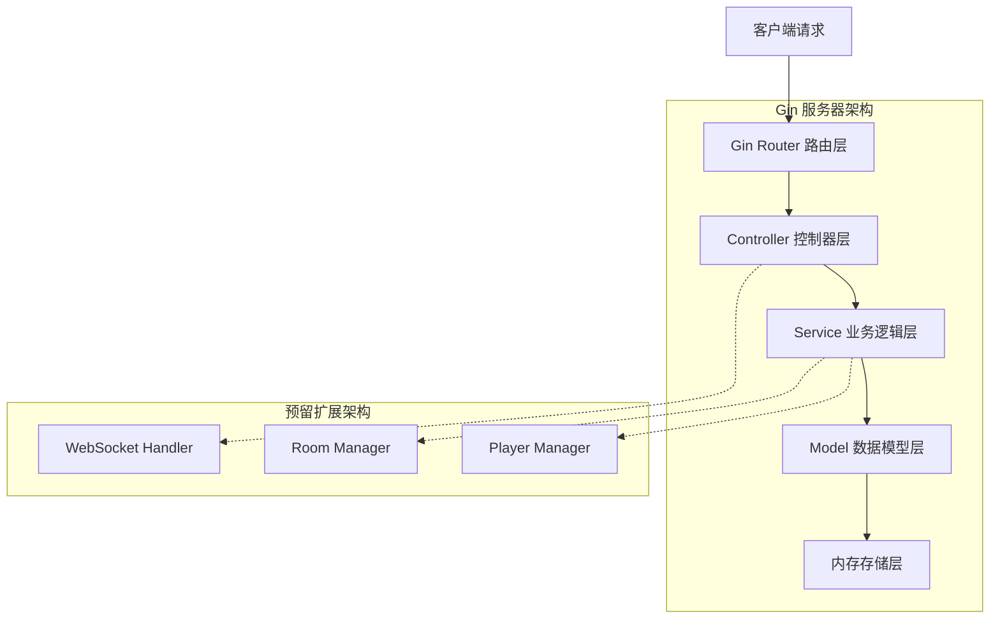
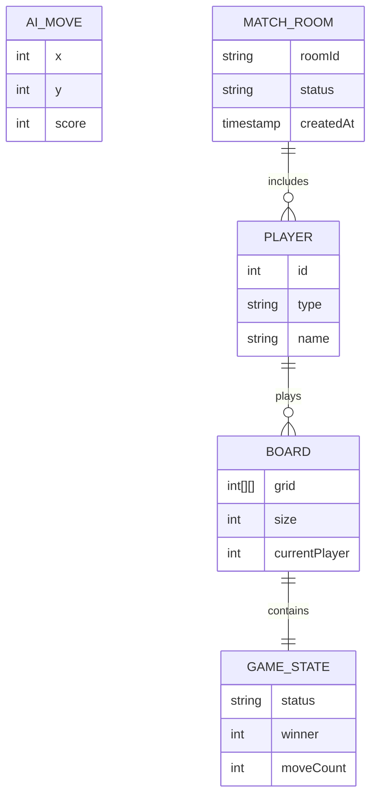

# 五子棋技术架构文档

## 1. Architecture design



## 2. Technology Description

* **前端**: Vue3\@3.3 + Vite\@4.4 + Axios\@1.5 + Vue Router\@4.2

* **后端**: Golang\@1.21 + Gin\@1.9 + CORS 中间件

* **开发工具**: Node.js\@20.19 + Go Modules

## 3. Route definitions

| Route     | Purpose            |
| --------- | ------------------ |
| /         | 游戏主页面，显示棋盘和控制面板    |
| /settings | 游戏设置页面，模式选择和配置（预留） |

## 4. API definitions

### 4.1 Core API

AI 对战相关接口

```
POST /api/ai/move
```

Request:

| Param Name | Param Type | isRequired | Description                |
| ---------- | ---------- | ---------- | -------------------------- |
| board      | int\[]\[]  | true       | 15x15 棋盘二维数组，0=空，1=玩家，2=AI |
| player     | int        | true       | 当前玩家标识，1=玩家，2=AI           |
| lastMove   | object     | true       | 上一步落子坐标 {x: int, y: int}   |

Response:

| Param Name | Param Type | Description                |
| ---------- | ---------- | -------------------------- |
| aiMove     | object     | AI 落子坐标 {x: int, y: int}   |
| gameStatus | string     | 游戏状态：playing/win/lose/draw |
| winner     | int        | 获胜方：0=无，1=玩家，2=AI          |

Request Example:

```json
{
  "board": [
    [0,0,0,0,0,0,0,0,0,0,0,0,0,0,0],
    [0,0,0,0,0,0,0,1,0,0,0,0,0,0,0],
    [0,0,0,0,0,0,0,0,0,0,0,0,0,0,0]
  ],
  "player": 1,
  "lastMove": {"x": 7, "y": 1}
}
```

Response Example:

```json
{
  "aiMove": {"x": 8, "y": 1},
  "gameStatus": "playing",
  "winner": 0
}
```

### 4.2 预留在线对战接口

```
POST /api/match/start
GET /api/match/status/:roomId
WebSocket /ws/game/:roomId
```

## 5. Server architecture diagram



## 6. Data model

### 6.1 Data model definition



### 6.2 Data Definition Language

当前阶段使用内存存储，无需数据库。以下为预留的数据结构定义：

**游戏棋盘结构 (Board)**

```go
// 棋盘数据结构
type Board struct {
    Grid          [][]int `json:"grid"`          // 15x15 棋盘网格
    Size          int     `json:"size"`          // 棋盘大小，默认15
    CurrentPlayer int     `json:"currentPlayer"` // 当前玩家：1=人类，2=AI
    MoveCount     int     `json:"moveCount"`     // 已下棋子数量
}

// 初始化空棋盘
func NewBoard() *Board {
    grid := make([][]int, 15)
    for i := range grid {
        grid[i] = make([]int, 15)
    }
    return &Board{
        Grid:          grid,
        Size:          15,
        CurrentPlayer: 1,
        MoveCount:     0,
    }
}
```

**玩家信息结构 (Player)**

```go
// 玩家信息
type Player struct {
    ID   int    `json:"id"`   // 玩家ID：1=人类，2=AI
    Type string `json:"type"` // 玩家类型：human/ai
    Name string `json:"name"` // 玩家名称
}

// 预留：在线匹配房间结构
type MatchRoom struct {
    RoomID    string    `json:"roomId"`    // 房间唯一标识
    Players   []Player  `json:"players"`   // 房间内玩家列表
    Board     *Board    `json:"board"`     // 当前棋盘状态
    Status    string    `json:"status"`    // 房间状态：waiting/playing/finished
    CreatedAt time.Time `json:"createdAt"` // 房间创建时间
}
```

**AI 落子结构 (AIMove)**

```go
// AI 落子响应
type AIMove struct {
    X      int `json:"x"`      // 落子 X 坐标
    Y      int `json:"y"`      // 落子 Y 坐标
    Score  int `json:"score"`  // 落子评分（用于 AI 算法）
}

// 游戏状态响应
type GameResponse struct {
    AIMove     AIMove `json:"aiMove"`     // AI 落子位置
    GameStatus string `json:"gameStatus"` // 游戏状态
    Winner     int    `json:"winner"`     // 获胜方
}
```

