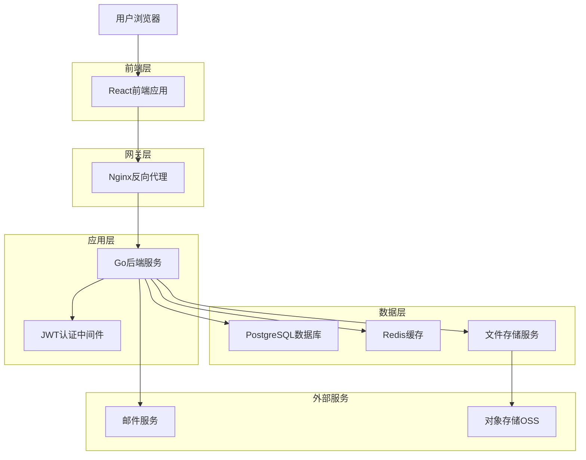
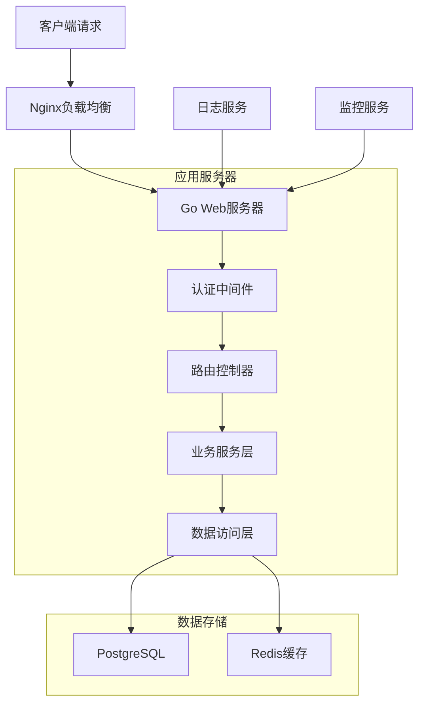
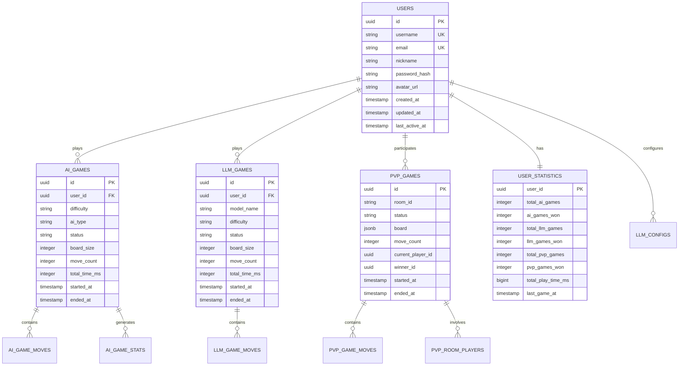

# 五子棋数据持久化与用户系统技术架构文档

## 1. 架构设计



## 2. 技术描述

* **前端**: React\@18 + TypeScript + Tailwind CSS + Vite + Pinia

* **后端**: Go\@1.21 + Gin + GORM + JWT + Redis

* **数据库**: PostgreSQL\@15 + Redis\@7

* **部署**: Docker + Nginx + SSL证书

* **存储**: 本地文件存储 + 阿里云OSS（可选）

* **邮件**: SMTP邮件服务

* **监控**: 日志记录 + 性能监控

## 3. 路由定义

| 路由               | 用途        |
| ---------------- | --------- |
| /login           | 用户登录页面    |
| /register        | 用户注册页面    |
| /dashboard       | 用户中心首页    |
| /history         | 游戏历史记录页面  |
| /statistics      | 数据统计分析页面  |
| /settings        | 个人设置页面    |
| /data-management | 数据管理页面    |
| /game/ai         | 人机对战游戏页面  |
| /game/llm        | LLM对战游戏页面 |
| /game/pvp        | 双人对战游戏页面  |

## 4. API定义

### 4.1 用户认证相关

用户注册

```
POST /api/auth/register
```

请求参数:

| 参数名      | 参数类型   | 是否必需  | 描述         |
| -------- | ------ | ----- | ---------- |
| username | string | true  | 用户名，3-20字符 |
| email    | string | true  | 邮箱地址       |
| password | string | true  | 密码，8-50字符  |
| nickname | string | false | 昵称，默认为用户名  |

响应:

| 参数名      | 参数类型    | 描述          |
| -------- | ------- | ----------- |
| success  | boolean | 注册是否成功      |
| message  | string  | 响应消息        |
| user\_id | string  | 用户ID（成功时返回） |

用户登录

```
POST /api/auth/login
```

请求参数:

| 参数名          | 参数类型    | 是否必需  | 描述       |
| ------------ | ------- | ----- | -------- |
| username     | string  | true  | 用户名或邮箱   |
| password     | string  | true  | 密码       |
| remember\_me | boolean | false | 是否记住登录状态 |

响应:

| 参数名            | 参数类型    | 描述      |
| -------------- | ------- | ------- |
| success        | boolean | 登录是否成功  |
| token          | string  | JWT访问令牌 |
| refresh\_token | string  | 刷新令牌    |
| user           | object  | 用户基本信息  |

### 4.2 游戏数据相关

获取游戏历史

```
GET /api/games/history
```

请求参数:

| 参数名         | 参数类型    | 是否必需  | 描述              |
| ----------- | ------- | ----- | --------------- |
| page        | integer | false | 页码，默认1          |
| limit       | integer | false | 每页数量，默认20       |
| game\_type  | string  | false | 游戏类型：ai/llm/pvp |
| start\_date | string  | false | 开始日期            |
| end\_date   | string  | false | 结束日期            |

响应:

| 参数名          | 参数类型    | 描述     |
| ------------ | ------- | ------ |
| games        | array   | 游戏记录列表 |
| total        | integer | 总记录数   |
| page         | integer | 当前页码   |
| total\_pages | integer | 总页数    |

保存游戏记录

```
POST /api/games/save
```

请求参数:

| 参数名        | 参数类型   | 是否必需 | 描述   |
| ---------- | ------ | ---- | ---- |
| game\_type | string | true | 游戏类型 |
| game\_data | object | true | 游戏数据 |
| moves      | array  | true | 步骤记录 |
| result     | string | true | 游戏结果 |

### 4.3 统计数据相关

获取用户统计

```
GET /api/statistics/user
```

响应:

| 参数名          | 参数类型    | 描述      |
| ------------ | ------- | ------- |
| total\_games | integer | 总游戏数    |
| win\_rate    | float   | 总胜率     |
| ai\_stats    | object  | AI对战统计  |
| llm\_stats   | object  | LLM对战统计 |
| pvp\_stats   | object  | PVP对战统计 |

获取趋势数据

```
GET /api/statistics/trends
```

请求参数:

| 参数名        | 参数类型   | 是否必需  | 描述                   |
| ---------- | ------ | ----- | -------------------- |
| period     | string | false | 时间周期：week/month/year |
| game\_type | string | false | 游戏类型                 |

### 4.4 数据管理相关

导出数据

```
POST /api/data/export
```

请求参数:

| 参数名         | 参数类型   | 是否必需  | 描述                        |
| ----------- | ------ | ----- | ------------------------- |
| format      | string | true  | 导出格式：json/csv/pdf         |
| data\_type  | string | true  | 数据类型：games/statistics/all |
| date\_range | object | false | 日期范围                      |

响应:

| 参数名           | 参数类型    | 描述     |
| ------------- | ------- | ------ |
| download\_url | string  | 下载链接   |
| file\_size    | integer | 文件大小   |
| expires\_at   | string  | 链接过期时间 |

## 5. 服务器架构图



## 6. 数据模型

### 6.1 数据模型定义



### 6.2 数据定义语言

用户表 (users)

```sql
-- 创建用户表
CREATE TABLE users (
    id UUID PRIMARY KEY DEFAULT gen_random_uuid(),
    username VARCHAR(50) UNIQUE NOT NULL,
    email VARCHAR(255) UNIQUE NOT NULL,
    nickname VARCHAR(100) NOT NULL,
    password_hash VARCHAR(255) NOT NULL,
    avatar_url VARCHAR(500),
    email_verified BOOLEAN DEFAULT false,
    is_active BOOLEAN DEFAULT true,
    role VARCHAR(20) DEFAULT 'user',
    created_at TIMESTAMP WITH TIME ZONE DEFAULT NOW(),
    updated_at TIMESTAMP WITH TIME ZONE DEFAULT NOW(),
    last_active_at TIMESTAMP WITH TIME ZONE DEFAULT NOW()
);

-- 创建索引
CREATE INDEX idx_users_username ON users(username);
CREATE INDEX idx_users_email ON users(email);
CREATE INDEX idx_users_last_active ON users(last_active_at DESC);

-- 初始化管理员用户
INSERT INTO users (username, email, nickname, password_hash, role, email_verified)
VALUES ('admin', 'admin@gomoku.com', '管理员', '$2a$10$...', 'admin', true);
```

AI游戏记录表 (ai\_games)

```sql
-- 创建AI游戏记录表
CREATE TABLE ai_games (
    id UUID PRIMARY KEY DEFAULT gen_random_uuid(),
    user_id UUID REFERENCES users(id) ON DELETE CASCADE,
    difficulty VARCHAR(20) NOT NULL CHECK (difficulty IN ('easy', 'medium', 'hard', 'expert')),
    ai_type VARCHAR(20) NOT NULL CHECK (ai_type IN ('enhanced', 'classic')),
    status VARCHAR(20) NOT NULL CHECK (status IN ('playing', 'human_win', 'ai_win', 'draw', 'abandoned')),
    board_size INTEGER DEFAULT 15 CHECK (board_size BETWEEN 15 AND 19),
    move_count INTEGER DEFAULT 0,
    total_time_ms INTEGER DEFAULT 0,
    started_at TIMESTAMP WITH TIME ZONE,
    ended_at TIMESTAMP WITH TIME ZONE,
    created_at TIMESTAMP WITH TIME ZONE DEFAULT NOW(),
    updated_at TIMESTAMP WITH TIME ZONE DEFAULT NOW()
);

-- 创建索引
CREATE INDEX idx_ai_games_user_id ON ai_games(user_id);
CREATE INDEX idx_ai_games_created_at ON ai_games(created_at DESC);
CREATE INDEX idx_ai_games_status ON ai_games(status);
CREATE INDEX idx_ai_games_difficulty ON ai_games(difficulty);
```

用户统计表 (user\_statistics)

```sql
-- 创建用户统计表
CREATE TABLE user_statistics (
    user_id UUID PRIMARY KEY REFERENCES users(id) ON DELETE CASCADE,
    total_ai_games INTEGER DEFAULT 0,
    ai_games_won INTEGER DEFAULT 0,
    ai_games_lost INTEGER DEFAULT 0,
    ai_games_drawn INTEGER DEFAULT 0,
    total_llm_games INTEGER DEFAULT 0,
    llm_games_won INTEGER DEFAULT 0,
    llm_games_lost INTEGER DEFAULT 0,
    llm_games_drawn INTEGER DEFAULT 0,
    total_pvp_games INTEGER DEFAULT 0,
    pvp_games_won INTEGER DEFAULT 0,
    pvp_games_lost INTEGER DEFAULT 0,
    pvp_games_drawn INTEGER DEFAULT 0,
    total_play_time_ms BIGINT DEFAULT 0,
    highest_win_streak INTEGER DEFAULT 0,
    current_win_streak INTEGER DEFAULT 0,
    last_game_at TIMESTAMP WITH TIME ZONE,
    created_at TIMESTAMP WITH TIME ZONE DEFAULT NOW(),
    updated_at TIMESTAMP WITH TIME ZONE DEFAULT NOW()
);

-- 创建触发器自动更新统计
CREATE OR REPLACE FUNCTION update_user_statistics()
RETURNS TRIGGER AS $$
BEGIN
    -- 更新用户统计逻辑
    IF TG_TABLE_NAME = 'ai_games' AND NEW.status != OLD.status AND NEW.status IN ('human_win', 'ai_win', 'draw') THEN
        UPDATE user_statistics 
        SET total_ai_games = total_ai_games + 1,
            ai_games_won = ai_games_won + CASE WHEN NEW.status = 'human_win' THEN 1 ELSE 0 END,
            ai_games_lost = ai_games_lost + CASE WHEN NEW.status = 'ai_win' THEN 1 ELSE 0 END,
            ai_games_drawn = ai_games_drawn + CASE WHEN NEW.status = 'draw' THEN 1 ELSE 0 END,
            total_play_time_ms = total_play_time_ms + COALESCE(NEW.total_time_ms, 0),
            last_game_at = NEW.ended_at,
            updated_at = NOW()
        WHERE user_id = NEW.user_id;
    END IF;
    RETURN NEW;
END;
$$ LANGUAGE plpgsql;

CREATE TRIGGER trigger_update_ai_game_stats
    AFTER UPDATE ON ai_games
    FOR EACH ROW
    EXECUTE FUNCTION update_user_statistics();
```

会话管理表 (user\_sessions)

```sql
-- 创建会话管理表
CREATE TABLE user_sessions (
    id UUID PRIMARY KEY DEFAULT gen_random_uuid(),
    user_id UUID REFERENCES users(id) ON DELETE CASCADE,
    session_token VARCHAR(255) UNIQUE NOT NULL,
    refresh_token VARCHAR(255) UNIQUE NOT NULL,
    ip_address INET,
    user_agent TEXT,
    expires_at TIMESTAMP WITH TIME ZONE NOT NULL,
    created_at TIMESTAMP WITH TIME ZONE DEFAULT NOW(),
    last_used_at TIMESTAMP WITH TIME ZONE DEFAULT NOW()
);

-- 创建索引
CREATE INDEX idx_user_sessions_user_id ON user_sessions(user_id);
CREATE INDEX idx_user_sessions_token ON user_sessions(session_token);
CREATE INDEX idx_user_sessions_expires ON user_sessions(expires_at);

-- 自动清理过期会话
CREATE OR REPLACE FUNCTION cleanup_expired_sessions()
RETURNS void AS $$
BEGIN
    DELETE FROM user_sessions WHERE expires_at < NOW();
END;
$$ LANGUAGE plpgsql;

-- 创建定时任务清理过期会话（需要pg_cron扩展）
-- SELECT cron.schedule('cleanup-sessions', '0 2 * * *', 'SELECT cleanup_expired_sessions();');
```

