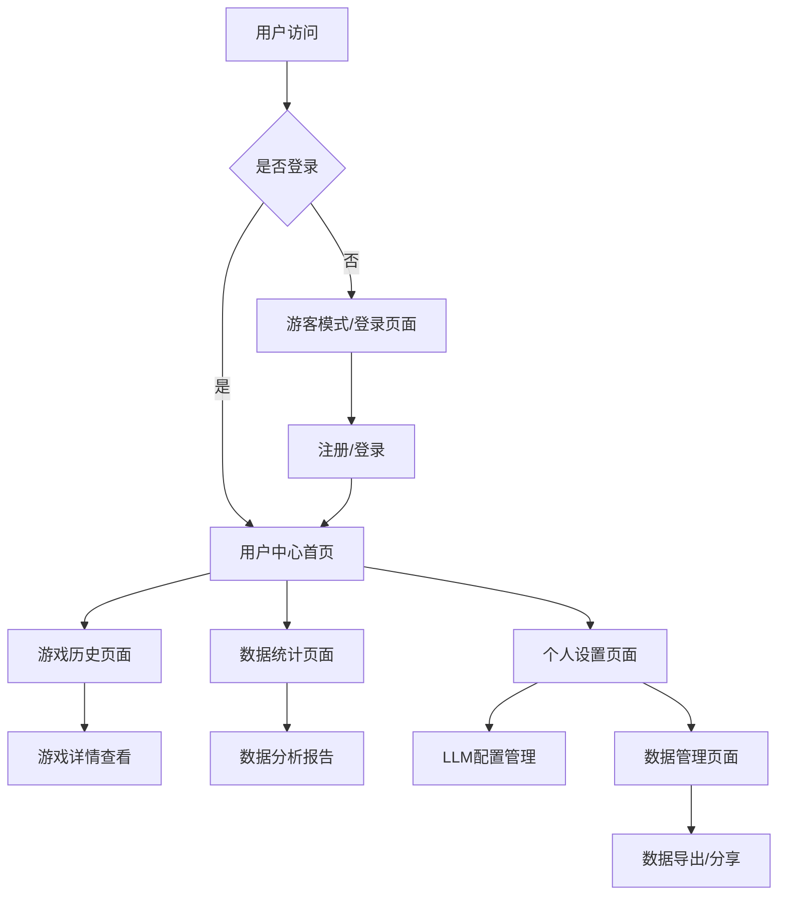

# 五子棋数据持久化与用户系统需求文档

## 1. 产品概述

基于现有五子棋游戏平台，构建完整的数据持久化系统和用户中心，为用户提供个人游戏数据管理、历史记录查看、统计分析等功能。
- 解决当前游戏数据无法保存的问题，为用户提供完整的游戏历史追踪和数据分析能力
- 通过用户系统建立个人游戏档案，提升用户粘性和游戏体验

## 2. 核心功能

### 2.1 用户角色

| 角色 | 注册方式 | 核心权限 |
|------|----------|----------|
| 游客用户 | 无需注册 | 可进行游戏但数据不保存，功能受限 |
| 注册用户 | 邮箱/用户名注册 | 完整的游戏数据保存、查看历史记录、个人统计 |
| 高级用户 | 付费升级或邀请 | 数据导出、高级统计分析、数据分享功能 |

### 2.2 功能模块

我们的数据持久化与用户系统包含以下主要页面：

1. **用户认证页面**：用户注册、登录、密码重置功能
2. **用户中心首页**：个人概览、快速统计、最近游戏记录
3. **游戏历史页面**：详细的游戏记录查看、回放功能
4. **数据统计页面**：多维度数据分析、图表展示
5. **个人设置页面**：账户管理、LLM配置、隐私设置
6. **数据管理页面**：数据导出、分享、备份功能

### 2.3 页面详情

| 页面名称 | 模块名称 | 功能描述 |
|----------|----------|----------|
| 用户认证页面 | 登录模块 | 支持用户名/邮箱登录，JWT令牌认证，记住登录状态 |
| 用户认证页面 | 注册模块 | 邮箱验证注册，用户名唯一性检查，密码强度验证 |
| 用户认证页面 | 密码重置 | 邮箱验证重置，安全问题验证，新密码设置 |
| 用户中心首页 | 个人概览 | 显示总游戏数、胜率、等级、最近活动时间 |
| 用户中心首页 | 快速统计 | 今日/本周/本月游戏统计，胜负趋势图表 |
| 用户中心首页 | 最近记录 | 最近10场游戏的简要信息和快速访问 |
| 游戏历史页面 | 记录列表 | 分页显示所有游戏记录，支持按时间、模式、结果筛选 |
| 游戏历史页面 | 详情查看 | 完整的游戏步骤回放，AI思考过程展示 |
| 游戏历史页面 | 搜索筛选 | 按日期范围、游戏模式、对手类型、结果筛选 |
| 数据统计页面 | 综合统计 | 各模式胜率、游戏时长、难度分布统计 |
| 数据统计页面 | 趋势分析 | 胜率变化趋势、游戏频率分析、技能提升曲线 |
| 数据统计页面 | 对比分析 | 不同AI难度表现对比、LLM模型效果对比 |
| 个人设置页面 | 账户管理 | 修改昵称、头像、邮箱、密码 |
| 个人设置页面 | LLM配置 | 管理API密钥、模型参数、自定义端点 |
| 个人设置页面 | 隐私设置 | 数据可见性、分享权限、删除账户 |
| 数据管理页面 | 数据导出 | 导出游戏记录为JSON/CSV格式，生成统计报告 |
| 数据管理页面 | 数据分享 | 生成分享链接，设置访问权限，社交媒体分享 |
| 数据管理页面 | 数据备份 | 自动备份设置，手动备份创建，备份恢复 |

## 3. 核心流程

### 用户认证流程
用户首次访问时可选择游客模式或注册登录。注册用户通过邮箱验证完成账户创建，登录后获得JWT令牌进行后续认证。

### 数据持久化流程
游戏进行中实时保存关键节点数据到Redis缓存，游戏结束后将完整数据持久化到PostgreSQL数据库，同时更新用户统计信息。

### 数据查看流程
用户登录后可在用户中心查看个人统计，通过游戏历史页面浏览详细记录，在数据统计页面进行深度分析。

## 4. 用户界面设计

### 4.1 设计风格
- **主色调**：深蓝色(#1e3a8a)和橙色(#f97316)，体现专业性和活力
- **按钮风格**：圆角矩形，渐变效果，悬停状态变化
- **字体**：主要使用微软雅黑，代码部分使用等宽字体
- **布局风格**：卡片式布局，左侧导航栏，响应式设计
- **图标风格**：线性图标配合实心图标，统一的视觉语言

### 4.2 页面设计概览

| 页面名称 | 模块名称 | UI元素 |
|----------|----------|---------|
| 用户认证页面 | 登录表单 | 居中卡片布局，输入框带图标，渐变登录按钮，记住密码选项 |
| 用户中心首页 | 统计卡片 | 网格布局的数据卡片，图标+数字+标题，悬停效果 |
| 游戏历史页面 | 记录列表 | 表格布局，分页组件，筛选器，状态标签 |
| 数据统计页面 | 图表展示 | 响应式图表，数据选择器，导出按钮，时间范围选择 |
| 个人设置页面 | 设置表单 | 分组表单，开关组件，文件上传，确认对话框 |

### 4.3 响应式设计
产品采用移动端优先的响应式设计，在桌面端提供完整功能，移动端优化核心功能的使用体验。

## 5. 数据持久化需求

### 5.1 人机对战数据
- **游戏记录**：完整的对局信息，包括难度、AI类型、结果、用时
- **步骤记录**：每一步的坐标、时间戳、玩家类型
- **AI性能数据**：搜索节点数、剪枝效率、响应时间统计

### 5.2 LLM对战数据
- **对局记录**：模型名称、配置参数、对战结果、总用时
- **推理过程**：每步的推理文本、置信度、响应时间
- **模型配置**：API密钥、端点设置、自定义参数

### 5.3 双人对战数据
- **房间信息**：房间ID、创建者、参与者、游戏状态
- **对战记录**：完整的对局历史、玩家信息、结果统计
- **实时数据**：当前游戏状态、聊天记录、在线状态

### 5.4 用户统计数据
- **综合统计**：总游戏数、各模式胜率、游戏时长
- **趋势数据**：按时间维度的胜率变化、活跃度统计
- **成就系统**：里程碑达成、等级进度、特殊成就

## 6. 权限分级体系

### 6.1 数据访问权限
- **游客用户**：无数据保存，无历史查看
- **注册用户**：完整的个人数据访问，基础统计功能
- **高级用户**：数据导出、高级分析、数据分享功能

### 6.2 功能权限控制
- **基础功能**：游戏进行、基本统计查看
- **高级功能**：数据导出、详细分析、API访问
- **管理功能**：数据删除、账户注销、隐私设置

## 7. 数据分享与导出

### 7.1 分享功能
- **成就分享**：生成精美的成就卡片，支持社交媒体分享
- **对局分享**：创建对局回放链接，设置访问权限
- **统计分享**：生成个人数据报告，可设置公开或私密

### 7.2 导出功能
- **数据格式**：支持JSON、CSV、PDF格式导出
- **导出内容**：游戏记录、统计数据、配置信息
- **批量操作**：支持按时间范围、游戏类型批量导出