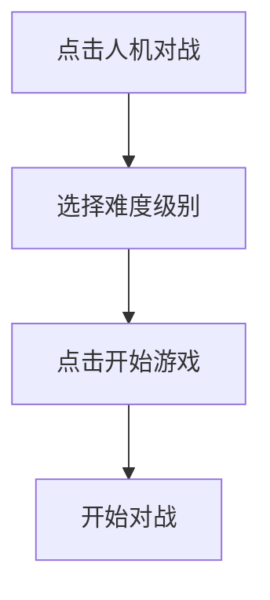
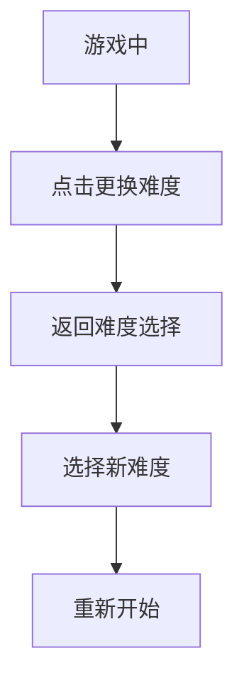

# 人机对战难度级别使用指南

本指南介绍如何使用增强AI的难度级别功能，享受不同强度的五子棋挑战。

## 🎮 功能概述

新的难度级别系统提供4个不同的AI强度级别，使用增强的Minimax算法 + Alpha-Beta剪枝技术：

- **初级 (Easy)** - 适合初学者
- **中级 (Medium)** - 平衡的游戏体验
- **高级 (Hard)** - 具有挑战性
- **专家 (Expert)** - 最强AI

## 🚀 快速开始

### 1. 启动游戏
1. 打开游戏主页
2. 点击 "人机对战" 卡片
3. 系统将显示难度选择界面

### 2. 选择难度
在难度选择界面中：
- 浏览4个难度级别的详细介绍
- 点击选择适合您的难度级别
- 点击 "开始游戏" 按钮

### 3. 开始对战
- AI将根据选择的难度级别进行对战
- 游戏界面显示当前难度信息
- 实时显示AI性能统计数据

## 📊 难度级别详解

### 🌱 初级 (Easy)
- **响应时间**: < 100ms
- **搜索深度**: 2层
- **算法特点**: 简单启发式评估
- **适合人群**: 五子棋初学者
- **游戏体验**: 轻松愉快，适合学习基本规则

### 🌿 中级 (Medium) - 默认推荐
- **响应时间**: 100-500ms
- **搜索深度**: 4层
- **算法特点**: Minimax + Alpha-Beta剪枝
- **适合人群**: 普通玩家
- **游戏体验**: 平衡的挑战性

### 🌳 高级 (Hard)
- **响应时间**: 500ms-2s
- **搜索深度**: 6层
- **算法特点**: 深度搜索 + 模式识别
- **适合人群**: 有经验的玩家
- **游戏体验**: 具有挑战性，需要仔细思考

### 🌲 专家 (Expert)
- **响应时间**: 2-5s
- **搜索深度**: 8层
- **算法特点**: 最大深度分析 + 时间限制
- **适合人群**: 高水平玩家
- **游戏体验**: 专业级挑战，需要最佳策略

## 🎯 游戏界面功能

### 难度信息显示
- 游戏界面顶部显示当前难度级别
- 可随时点击 "更换难度" 返回选择界面

### AI性能统计
当使用增强AI时，游戏界面右侧显示：
- **搜索节点数**: AI分析的移动数量
- **剪枝次数**: Alpha-Beta剪枝优化次数
- **剪枝效率**: 优化效率百分比
- **搜索时间**: AI思考用时

### 游戏统计
系统自动记录：
- 总体胜率统计
- 按难度级别的详细统计
- 历史游戏记录

## 🔧 技术特性

### 算法优势
- **Minimax算法**: 深度搜索最优解
- **Alpha-Beta剪枝**: 大幅提升搜索效率
- **转置表**: 缓存已评估位置，避免重复计算
- **时间管理**: 确保响应时间在合理范围内

### 性能特征
| 难度 | 平均响应时间 | 搜索节点数 | 内存使用 | 剪枝效率 |
|------|--------------|------------|----------|----------|
| 初级 | < 100ms | 1,000-5,000 | ~1MB | 40-50% |
| 中级 | 100-500ms | 10,000-50,000 | ~2MB | 50-60% |
| 高级 | 500ms-2s | 50,000-200,000 | ~5MB | 55-65% |
| 专家 | 2-5s | 100,000-500,000+ | ~10MB | 60-70% |

## 📱 使用建议

### 新手玩家
1. 从 **初级** 开始熟悉游戏
2. 逐步提升到 **中级**
3. 在掌握基本策略后再尝试高级别

### 进阶玩家
1. 直接从 **中级** 开始挑战
2. 根据表现调整难度级别
3. 尝试在 **高级** 难度下获得胜利

### 高水平玩家
1. 直接挑战 **专家** 难度
2. 分析AI的统计数据进行策略优化
3. 尝试在不同难度下保持高胜率

## 🎮 界面操作指南

### 开始新游戏

### 更换难度

### 查看统计
游戏结束后自动显示：
- 当前难度的胜负统计
- AI性能数据
- 历史游戏汇总

## ⚡ 性能提示

### 响应时间
- 初级和中级响应迅速，适合快节奏游戏
- 高级和专家需要更多思考时间
- 系统会在5秒内强制返回结果

### 设备要求
- 所有难度级别都支持现代浏览器
- 专家级别建议使用性能较好的设备
- 移动设备建议使用中级或以下难度

### 网络要求
- 需要稳定的网络连接
- 增强AI功能需要后端服务支持
- 如遇网络问题会自动切换到经典AI

## 🐛 故障排除

### 常见问题

**Q: AI响应时间很长怎么办？**
A: 选择较低难度级别，或检查网络连接

**Q: 游戏界面显示异常？**
A: 刷新页面重新开始游戏

**Q: AI统计数据不显示？**
A: 确保使用的是增强AI模式，而非经典模式

**Q: 难度级别无法切换？**
A: 重新开始游戏，在游戏开始前选择难度

### 技术支持
如果遇到问题：
1. 刷新浏览器页面
2. 检查网络连接
3. 尝试切换到经典AI模式
4. 联系技术支持

## 🎯 策略建议

### 不同难度的应对策略

**对战初级AI**:
- 专注于基本的连线策略
- 学习制造威胁和防守
- 练习基本的进攻和防守模式

**对战中级AI**:
- 注意AI的防守意图
- 制造多重威胁
- 学习位置控制

**对战高级AI**:
- 深度思考每一步的影响
- 关注长期战略布局
- 利用AI的思考时间进行深入分析

**对战胜家AI**:
- 需要精确的计算和预判
- 掌握复杂的战术组合
- 可能需要研究开局定式

## 📈 成绩追踪

系统自动追踪您的游戏表现：
- 每个难度级别的胜率
- 游戏总时长和平均时长
- 改进趋势分析
- 个人最佳成绩

使用这些数据来：
- 评估自己的进步
- 选择合适的难度级别
- 制定提升计划

祝您游戏愉快！🎮✨